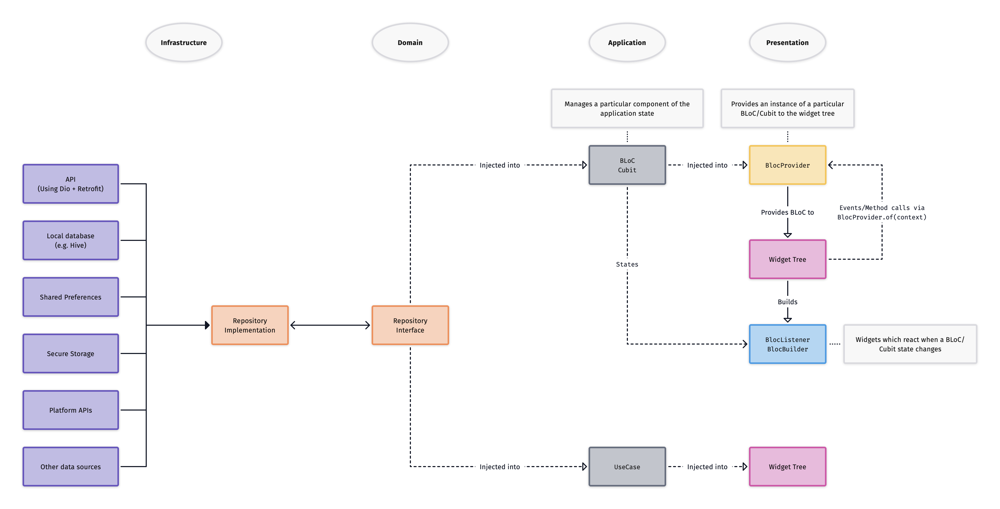

# Architecture Layers



Flutter projects should contain 4 distinct layers: **presentation**, **application**, **domain**, and **infrastructure**.

## 🥞 Layer Definitions

### ✨ Presentation Layer

The presentation layer should _only_ contain Widgets. Use this layer to implement your user interface.

As much as possible, Widget classes should be free of business logic. Form validation is a reasonable exception to this rule.

Classes in the presentation layer should depend on classes from the application and domain layers.

### 🤖 Application Layer

This is the main business logic layer of the application, and should contain BLoCs, Cubits, and use-cases.

These classes should depend on entity/value-object classes and repository interfaces from the domain layer.

### 💭 Domain Layer

Defines the core business domain, including entities, value-objects, and repository interfaces.

These classes should be pure Dart (no Flutter imports) and should not depend on any other layers.

### 🗄 Infrastructure Layer

This layer contains implementations of the repository interfaces from the domain layer. Repository implementations may depend on other classes like data sources or REST API services.

It's a good idea to use Data Transfer Objects (DTOs) which represent the structure of the data returned from external services. These can then be converted to and from your entity classes. This ensures the entities are not dependent on the data structure of objects returned from external services.

## 💉 Dependency Injection

`get_it` + `injectable` is a fantastic way of implementing dependency injection.

BLoCs and Cubits should be injected into the widget tree using `BlocProvider`. This allows the BLoC/Cubit to be accessible to all children via `BlocProvider.of(context)`. It also allows `BlocListener`, `BlocBuilder`, and `BlocConsumer` to find instances automatically, and ensures the closure of underlying `Stream`s are handled automatically.

```dart
BlocProvider(
	create: (_) => GetIt.I<MyBloc>(),
	child: BlocBuilder<MyBloc, MyState>(
		builder: (context, state) {
			// TODO Implement builder
		},
	),
);
```

## 📂 Directory Structure

The best directory structure usually involves having a directory for each layer. The layer directories are then subdivided into features.

Another option is to have top-level directories for each feature, which are then subdivided into layers.

## 🏛 Architecture Best Practices

- Stateful Widgets should only be used when absolutely necessary (e.g. when building a form). Most of the time, it's better to use a BLoC with a Stateless Widget.
- As much as possible, classes should depend on interfaces (implemented as abstract classes in Dart), not implementations.
