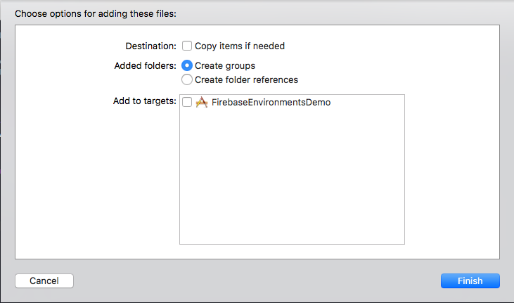
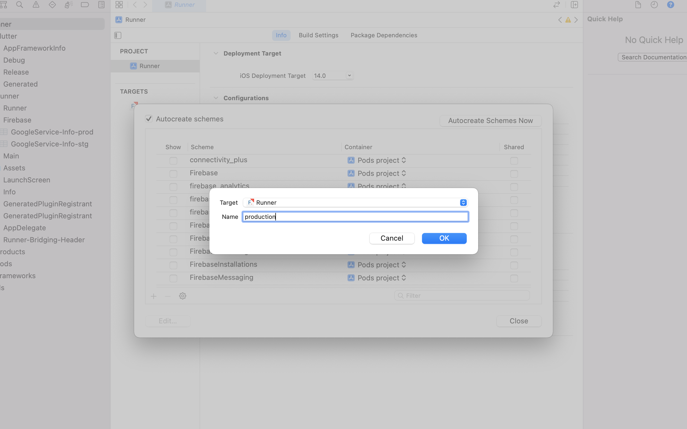
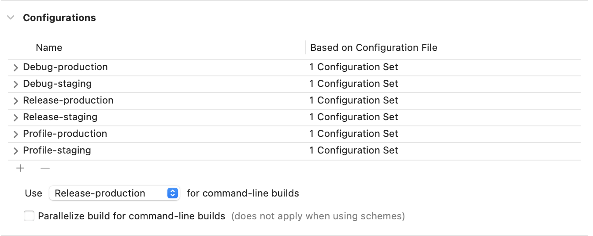

# Multiple Firebase Environments

If you're using Firebase for your Flutter app, you **must** set up multiple environments for staging and production versions of the app. This ensures that any data is kept separate, and access can be tailored to suit the environment.

This guide will take you through the process of configuring a Flutter app to work with multiple Firebase projects.

## Step 1: Create Firebase projects


You'll need to create 2 Firebase projects in the usual way for your app. Our naming convention is [App Name] - [Environment].

For example, for Flexed, our projects are:


- Flexed - Staging
- Flexed - Production

Within each project, create iOS and Android apps. Ignore the setup steps for now, but download the relevant configuration files (the `google-services.json` and `GoogleService-Info.plist` files).

The bundle IDs should be the same **except** that the staging IDs should have the `.stg` suffix:


- Staging: `uk.co.flexed.stg`
- Production: `uk.co.flexed`

Finally, set up any Firebase products you may need (App Distribution, Analytics etc).

## Step 2: Set up Firebase in your app


Follow the setup steps linked [here](https://firebase.flutter.dev/docs/overview) to integrate Firebase into your app, including the platform-specific installation guides for iOS and Android. However, **don't** add the configuration files yet.

## Step 3: Android configuration setup


We first need to create product flavors for the staging and production environments. In the `android/app/build.gradle` file, in the `android` section, add the following:

```groovy
flavorDimensions "env"
productFlavors {
	production {
		dimension "env"
		applicationIdSuffix ""
		resValue "string", "app_name", "{{INSERT YOUR APP NAME HERE}}"
	}
	staging {
		dimension "env"
		applicationIdSuffix ".stg"
		resValue "string", "app_name", "{{INSERT YOUR APP NAME HERE}} [STG]"
	}
}
```


Then, copy the `google-services.json` files we downloaded earlier into the following directories:


- Production: `android/app/src/production`
- Staging: `android/app/src/staging`

That's it!

## Step 4: iOS Configuration Setup


### Add your PLIST files


Take the `GoogleService-Info.plist` files we downloaded from Firebase earlier and rename them as follows:


- Staging: `GoogleService-Info-stg.plist`
- Production: `GoogleService-Info-prod.plist`

Then, create a directory under `ios/Runner` called `Firebase`, and move the PLIST files into that folder. **Don't use Xcode for this step!**

Next, open Xcode, and drag the Firebase directory we just created into the project.

**Be sure to uncheck "Copy items if needed" and all targets under "Add to targets".**



### Create custom schemes


In Xcode again, go to **Product → Scheme → Manage Schemes**, and use the + button to create two new schemes, targeting "Runner", named `production` and `staging`:



*Make sure the Shared checkbox is enabled for each of these new schemes.*

Now select the Runner project and check that you have the following configurations set up:



### Add a new Run Script build phase


Select the Runner target in Xcode and go to **Build Phases**. Use the + button to add a new Run Script phase, and paste the following script:

```Bash
PLIST_DESTINATION=${BUILT_PRODUCTS_DIR}/${PRODUCT_NAME}.app

if [ "${CONFIGURATION}" == "Debug-staging" ] || [ "${CONFIGURATION}" == "Release-staging" ] || [ "${CONFIGURATION}" == "Profile-staging" ]; then
cp -r "${PROJECT_DIR}/Runner/Firebase/GoogleService-Info-stg.plist" "${PLIST_DESTINATION}/GoogleService-Info.plist"
echo "Staging plist copied"
elif [ "${CONFIGURATION}" == "Debug-production" ] || [ "${CONFIGURATION}" == "Release-production" ] || [ "${CONFIGURATION}" == "Profile-production" ]; then
cp -r "${PROJECT_DIR}/Runner/Firebase/GoogleService-Info-prod.plist" "${PLIST_DESTINATION}/GoogleService-Info.plist"
echo "Production plist copied"
fi

```


This script will copy the relevant PLIST file into the final app binary.

## Step 5: Run or build using the correct flavor


Now, whenever you build or run the app, simply add `--flavor staging` or `--flavor production` to the command to specify which flavour you need.
