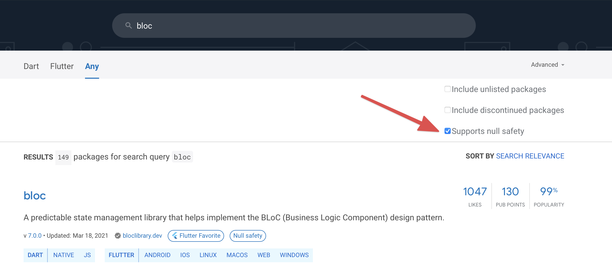

# Using Third-party Packages

Third-party packages and plugins are a great way to speed up development. Instead of implementing something from scratch, you can pull in a package which provides a ready-made implementation.

We encourage the use of third-party packages in our projects, with a few important considerations.

## Pub score, popularity, and activity

On [pub.dev](https://pub.dev/), packages are given a [score](https://pub.dev/help/scoring) based on their quality. Their popularity is also measured as a percentage.

It's important to check these metrics before you decide to use a package. They are generally good indicators of the state of the package.

It may also be a good idea to look at the package's GitHub repository and check:

- How long ago the latest commit was
- How many stars it has

If the package hasn't been updated for a number of months, it's possible that the package has become abandoned. It's extremely inadvisable to depend on abandoned or poorly maintained packages in your project.

## Null-safety

Our Flutter projects use sound null-safety. It's therefore crucial that any packages also use sound null-safety.

On pub.dev, you can filter search results to show only null-safe packages:

## Review new packages in PRs

If you're reviewing a pull request and notice that a new dependency has been added, take a minute to look it up on pub.dev to verify it's safe to use in the project. Feel free to ask the submitter to justify their dependency on the package. Depending on a poorly maintained or abandoned package will cause problems for the whole team in future, so it's important to get a second pair of eyes on any new dependencies.
