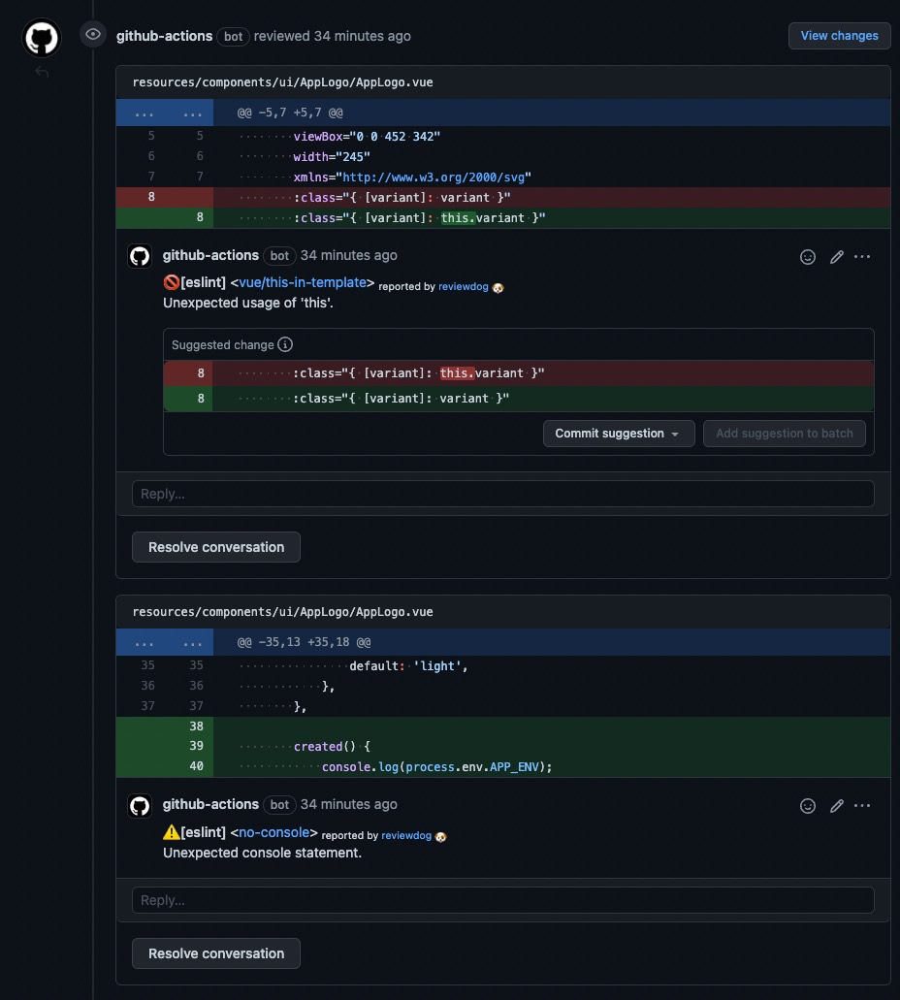
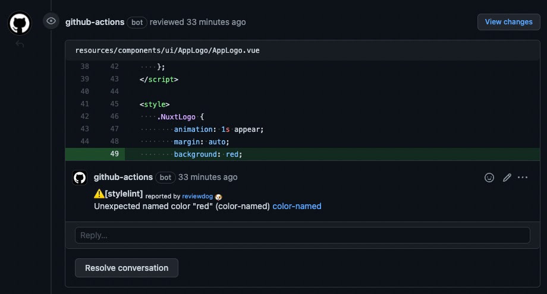
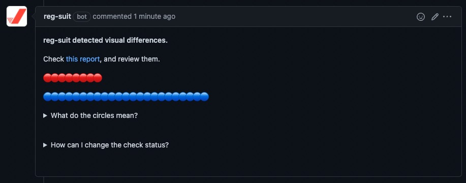
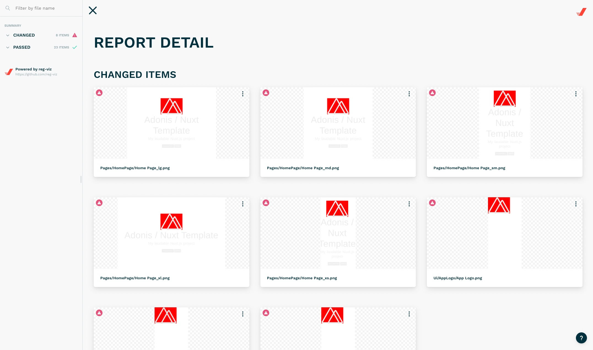
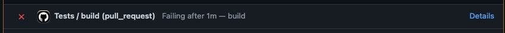
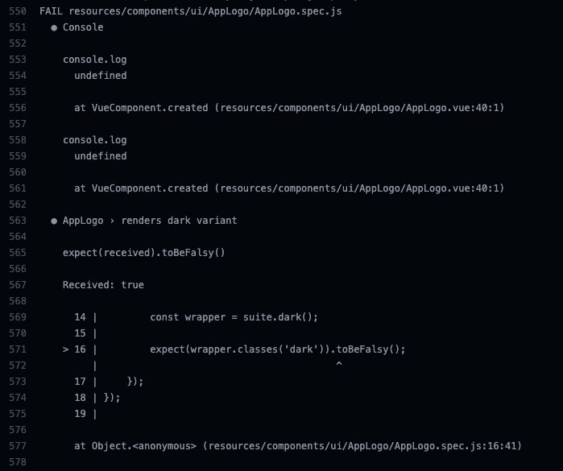

# Automated Workflows

We utilise automated workflows to ensure the code we're producing meets the standards defined by our automated linting tooling, and quality guidelines from our coding standards and visual accuracy. These actions are triggered as part of our [pull request process](../general/pull-requests.md) via GitHub actions.

## Linting

To enforce our [linting rules](./linting/README.md) we have a defined composite action for each linting package:

- [Reviewdog Eslint](https://github.com/netsells/github-actions-frontend/tree/main/reviewdog-eslint)
- [Reviewdog Stylelint](https://github.com/netsells/github-actions-frontend/tree/main/reviewdog-stylelint)

See it in action here:

<spoiler>

**Eslint**

**Stylelint**

</spoiler>

## Visual Regression Testing

As part of our Visual Regression Testing guidelines, we have a workflow for generating and approving the changes to ensure they are accurate to design, and do not introduce any visual regressions in other areas of the app.

When a PR is created, the workflow will run and generate a couple of things: 
- Summary of changes introduced in this PR, broken down by modified, created and deleted
- A link to the Visual Regression Testing results

The composite action responsible for this workflow [can be seen here](https://github.com/netsells/github-actions-frontend/tree/main/visual-regression-testing).

See it in action here:

<spoiler>

**Change Summary**

**Results UI**

</spoiler>

## Tests

Tests are an important part of our workflow, and ensure that our code is rigid and free from errors as much as possible. To ensure that new code does not break any existing tests, we have a workflow set up to automatically run the test suite of the codebase.

The composite action for this workflow [can be seen here](https://github.com/netsells/github-actions-frontend/tree/main/tests).

See it in action here:

<spoiler>

**PR Status Check**

**PR Output**

</spoiler>
